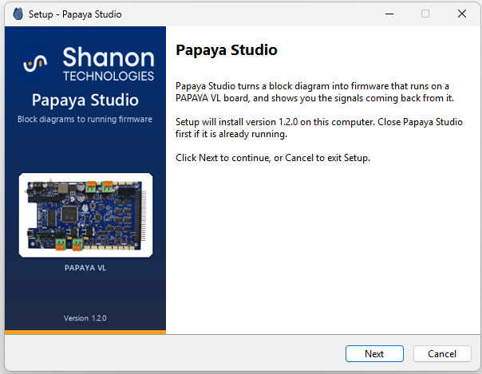
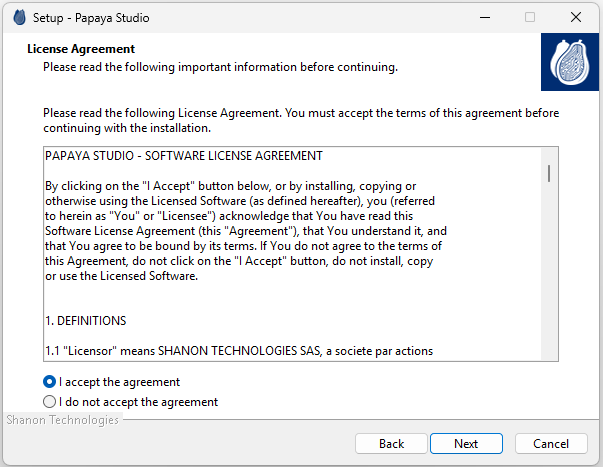
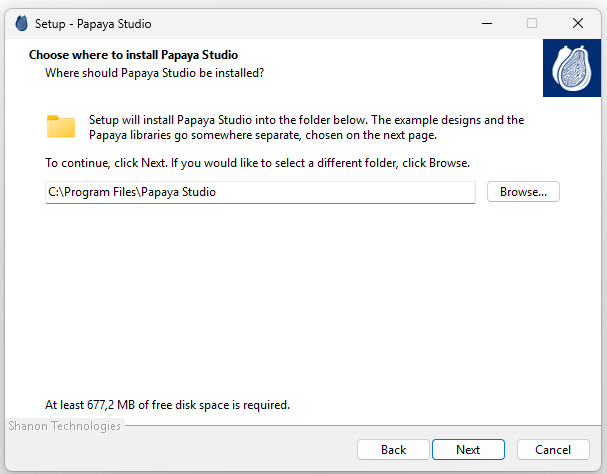
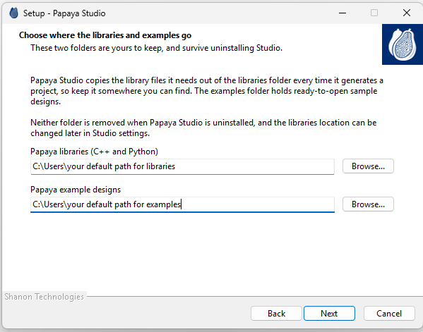
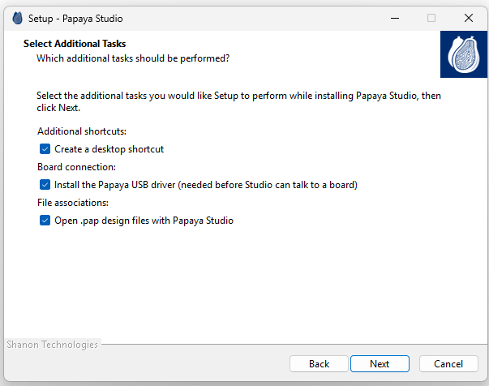
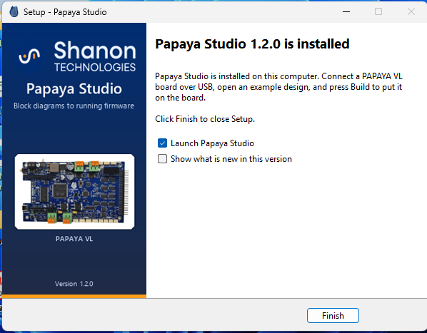
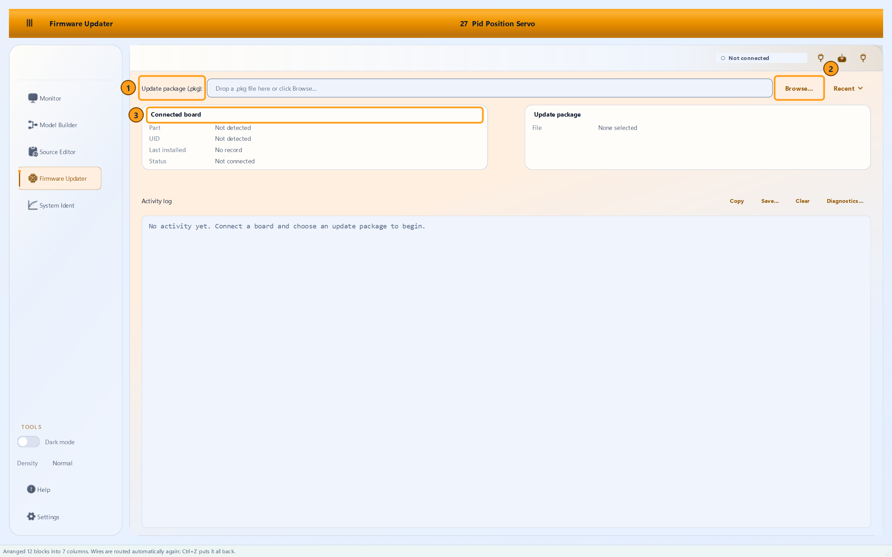

# PAPAYA Studio releases

PAPAYA Studio, by Shanon Technologies: the Windows installer, the firmware for the
PAPAYA VL board, the manuals and the datasheet, the C++ and Python libraries and the
example designs.

**[Download the latest release](https://github.com/ShanTechSw/papaya-studio-releases/releases/latest)**

## How the releases are kept

Every release has its own folder under `releases/`, named after its
version, and a folder is never changed once it is published. Each one holds that
release's firmware package, the User Manual, the Programmer Manual, the C++ and Python
Reference and the Datasheet, the libraries and the examples, and the SHA-256 checksum of
every file, with a README saying what changed.

The installer of each version is attached to the GitHub release of the same name,
rather than kept in its folder: GitHub does not store files larger than 100 MB inside a
repository, and the installer is larger than that.

Releases are listed here as they are published.

## System requirements

* Windows 10 (version 1809 or later) or Windows 11, 64-bit.
* About 2 GB of disk space for the application, the examples and the manual.
* A USB port, when you have a board. Everything else runs without one.

## Installing PAPAYA Studio

You need one file, `PapayaStudio-Setup-<version>.exe`, from the release you want.
Everything the application needs is inside it: the runtime, the libraries, the USB
driver and the example designs. Nothing else has to be downloaded first.

Its SHA-256 checksum is published beside it. To check that the download arrived intact,
run this in the folder you downloaded into and compare the result with the published
value:

```
certutil -hashfile PapayaStudio-Setup-<version>.exe SHA256
```

### Before the wizard appears

**Windows may warn you.** The installer is not yet signed with a code-signing
certificate, so Windows shows a blue *Windows protected your PC* screen on first run.
Click **More info**, then **Run anyway**.

**Setup checks the machine.** It reads the Windows build, the amount of physical RAM,
the free space on the install drive and the number of processor cores, and compares
them with the minimums this build was measured against. Anything below a minimum, or a
reading that Windows refuses to give (group policy and some anti-malware products block
them), produces a warning naming the value it found and the value it wants, and asks
whether to continue anyway. The default answer is no. Windows versions below the
supported minimum are refused by Windows itself before Setup starts.

**Setup asks who it is for.** *Install for all users* needs an administrator and puts
the application in Program Files. *Install for me only* needs no administrator, and
installs into your own profile. The difference matters for one thing: the USB driver
can only be installed by an administrator, so a per-user install leaves it out and says
so on the last page.

### The pages of the wizard

**1. Welcome.** Nothing to answer. It names the version you are about to install. Close
PAPAYA Studio first if it is already running.



**2. Licence Agreement.** Accept the licence to continue. The same text is installed
beside the application as `PAPAYA_STUDIO_EULA.txt`, so you can read it again later.



**3. Choose where to install PAPAYA Studio.** The program folder. It defaults to Program
Files for an all-users install, or your own profile for a per-user one. This is the
application itself, not your work: the example designs and the libraries are chosen on
the next page. The page states the free space the install needs before you commit to it.



**4. Choose where the libraries and examples go.** Two folders of your own. The defaults
are `Documents\Papaya Studio\Libraries` and `Documents\Papaya Studio\Examples`. Studio
copies library files out of the first every time it generates a project, and the second
holds the ready-to-open designs. See
[the libraries folder and the examples folder](#the-libraries-folder-and-the-examples-folder)
below.



**5. Select Additional Tasks.** A desktop icon, the USB driver, and the `.pap` file
association. The one that matters is the USB driver: without it Studio cannot talk to a
board, and it needs an administrator, so it is offered only on an all-users install.



**6. Ready to install.** Nothing to answer. It lists the program folder, the libraries
folder, the examples folder, the shortcut group and the tasks you chose. Read it: this
is the last point where **Back** is still possible.

**7. Installing.** A few minutes. It copies the application, the libraries and the
examples, then installs the Visual C++ runtime and the USB driver if they are needed.

**8. Finished.** Choose whether to launch PAPAYA Studio and whether to open the release
notes. Any notice about a driver or a runtime that could not be installed appears here,
so it is worth reading rather than clicking straight through.



### The libraries folder and the examples folder

These two are yours, not the application's.

**The libraries folder** holds the C++ and Python libraries that a generated project
needs. Every time Studio generates a project, it copies the required library files out
of this folder. Studio finds it again through a registry value written at install time,
and **Settings > Libraries folder** can point Studio somewhere else later without moving
anything.

**The examples folder** holds the ready-to-open sample designs. **Help > Manage
Packages** reports what is installed there and updates it.

Three rules apply to both:

* **Neither is removed when you uninstall PAPAYA Studio.** You may have edited an
  example or updated a library, and an uninstaller that deleted your work would be
  wrong.
* **They must be separate folders**, and neither can be inside the other, or inside the
  program folder. Setup refuses to continue otherwise and says why.
* **Upgrading remembers where you put them.** A later installer offers the folders this
  one used, not the defaults, including when Studio applies an update itself with no
  wizard on screen.

### What ends up in the Start menu

| Entry | What it does |
|---|---|
| **PAPAYA Studio** | Starts the application. |
| **PAPAYA Example Designs** | Opens the examples folder you chose. |
| **Reinstall the PAPAYA USB Driver** | Installs the USB driver. Right-click it and choose *Run as administrator*; it does nothing without that. |
| **Uninstall PAPAYA Studio** | Removes the application. Your libraries, examples, projects and settings stay. |

### Notices on the last page

**"the PAPAYA USB driver was not installed"** appears after a per-user install. Studio
starts and everything that does not need a board works, but **Connect** finds nothing
until an administrator runs *Reinstall the PAPAYA USB Driver* from the Start menu.

**"missing the Microsoft Visual C++ runtime"** appears when the machine does not have
that runtime and this install had no administrator rights to add it. PAPAYA Studio will
not start until it is present. Run the same installer again as an administrator, or
install *Microsoft Visual C++ 2015-2022 Redistributable (x64)* from Microsoft.

### Running the installer again

If PAPAYA Studio is already installed, Setup asks what to do before anything else
happens:

| Answer | Result |
|---|---|
| **Yes** | Repairs or replaces the installed copy. Your settings and projects are untouched. This is also how you install a newer version over an older one. |
| **No** | Uninstalls the existing copy completely, then closes. Run the installer again afterwards for a fresh install. |
| **Cancel** | Closes Setup, changing nothing. |

When Studio applies an update itself, through **Help > Apply Update from File...**, the
installer runs with no wizard on screen and takes the *Repair* path automatically.

### When an installation goes wrong

Setup writes a log into your temporary folder every time it runs, named
`Setup Log <date> #<n>.txt`. If an install fails, that file says which step failed and
why. Type `%TEMP%` into the Explorer address bar to find it, and attach it to a support
request.

## Updating the board firmware

Every release folder carries the firmware package for the PAPAYA VL board, a
`.pkg` file. It is installed over the same USB cable that carries designs:
there is no separate programmer and no debug probe.



**Before you start.** Stop any running design (the stop button in the Model
Builder top bar resets the board), close any script that is holding the board,
and save your work.

1. **Open the Firmware Updater** from the navigation rail in PAPAYA Studio.
2. **Give it the package.** Drag the `.pkg` onto the drop field, or click
   **Browse...** and pick it. The last eight packages you used are listed under
   **Recent**. Only `.pkg` files are accepted.
3. **Read the two identity cards.** One is the connected board, the other is the
   package: part number, unique id and version on each. The status chip says
   whether the board is **Not connected**, **App connected** or
   **Bootloader connected**.
4. **Let the pre-flight check run.** Studio refuses to flash a package meant for
   a different part or a different board, and asks before installing a version
   older than the one it last installed, or the same version again.
5. **Start the update.** The board is reset into update mode automatically where
   it can be. If it cannot be, Studio asks you to press and release the board's
   RESET button, and keeps retrying for up to 60 seconds.
6. **Watch the four phases**: uploading (1/2), uploading (2/2), finalising
   installation, restarting device. **Do not unplug the board during the first
   three.** If you have to stop, use the abort button, which stops at the next
   safe point rather than mid-write.
7. **Check the result.** The log ends with a line saying the update is complete
   and the device is running the new firmware, and Studio verifies the board
   after the reboot. If it cannot re-establish the session by itself, click
   **Connect**.

If anything goes wrong, **Diagnostics...** saves a bundle (log, manifest and
identity) you can attach to a support message.

**Package versions.** A v1 package is unencrypted; a v2 package is encrypted and
is decrypted only on the device. Studio says which one a given board needs if
you offer it the wrong kind.

## What is published here

| Release | Folder | Installer |
|---|---|---|
| 1.2.0 | [`releases/1.2.0/`](releases/1.2.0/) | attached to the GitHub release |

## Licence

PAPAYA Studio is free to download and use, but it is not open source. The terms are in
[`LICENSE`](LICENSE): the same text the installer shows, and installs beside the
application as `PAPAYA_STUDIO_EULA.txt`.
